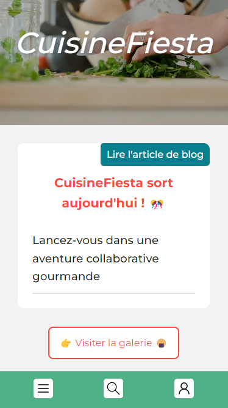
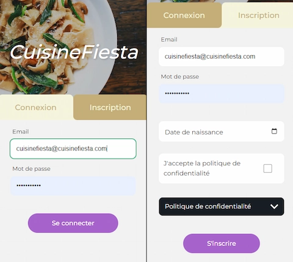
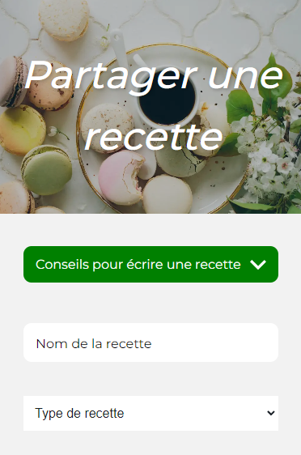
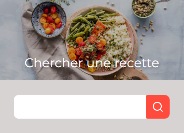
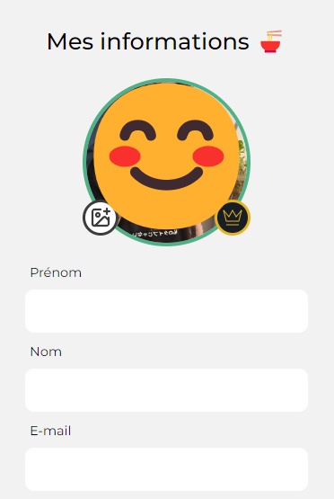

# **CuisineFiesta App**

Bienvenue sur **CuisineFiesta App**, l'application mobile où chacun peut partager ses recettes.

## Aperçu

CuisineFiesta App est une application conviviale qui vous permet de découvrir, partager et apprendre de nouvelles recettes de cuisine. 

### Création de compte / Connexion

Avec notre plateforme, la création de votre compte membre est simple et utile.

Une fois authentifié, vous pouvez accéder à toutes les fonctionnalités de l'application. Ultérieurement, il vous faudra un abonnement afin d'accéder aux fonctionnalités dites premium.

### Vos Propres Recettes

Appuyez sur "Ajouter une Recette" depuis n'importe quelle page, le lien se trouve dans le menu burger (voir ci-dessous).

Remplissez le formulaire avec le nom de la recette, les ingrédients, les étapes de préparation. Vous pourrez même bientôt ajouter une photo appétissante.
Publiez votre recette pour que d'autres membres puissent la découvrir et l'essayer à leur tour.

### Galerie de Recettes

Explorez la galerie pour découvrir une variété de recettes partagées par d'autres membres. Consultez les détails de chaque recette pour vous aider à choisir celle que vous souhaitez essayer. Dans le futur, il sera possible de laisser des commentaires pour chaque recette.

### Recherche par titre

Utilisez la fonction de recherche pour trouver des recettes spécifiques en saisissant le titre de la recette.

## Pour conclure

CuisineFiesta App vous offre une expérience culinaire enrichissante et sociale. Rejoignez notre communauté de passionnés de cuisine dès aujourd'hui !

### Informations complémentaires

*Paramètres de Compression des Images*

Pour garantir une expérience de téléchargement rapide, les images sont compressées au format Webp avec un effort de 6 et une qualité de 62%.

### **License**

CuisineFiesta App est distribué sous la Licence *GNU Affero General Public License*.
